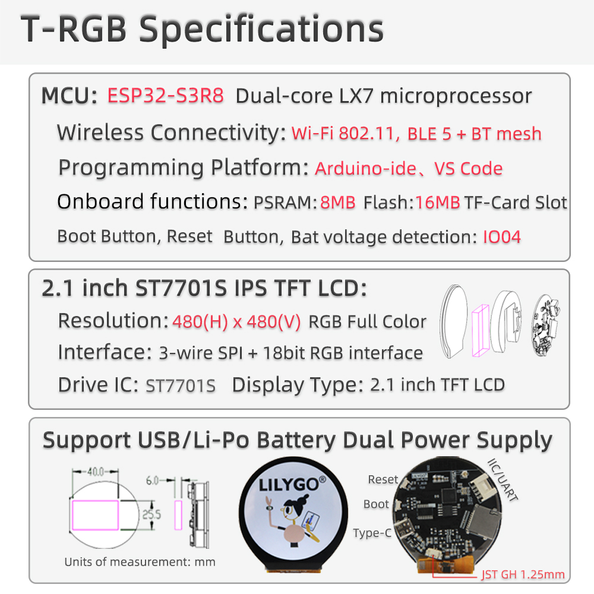

<h1 align = "center"> 🌟T-RGB🌟</h1>

## Description

`T-RGB` is a development board whose main control chip is ESP32-S3. It is equipped with a `2.1-inch LCD` color screen (3SPI&RGB interface) and `FT3267` touch chip. It has TF card reading and writing function and is equipped with a programmable button and a set of IIC pins. It can be powered with a lithium battery and charged with a USB. You can use the ESP32S3 directly for USB communication or programming.

## Pinmap

## Product 📷

|  Product |  Product Link |
| :--------: | :---------: |
| T-RGB |  [AliExpress](https://www.aliexpress.us/item/1005004778542414.html)   |

## Quick Start

> Arduino:
>- Click "File" in the upper left corner -> Preferences -> Additional Development >Board Manager URL -> Enter the URL in the input box.
(ESP32S3 is a new chip, and the SDK version needs to be version 2.0.3 or above)
> `https://raw.githubusercontent.com/espressif/arduino-esp32/gh-pages/package_esp32_index.json`
>-  Click OK and the software will be installed by itself. After installation, restart the Arduino IDE software.
>- Setting: 

> PlatfromIO:
> - PlatformIO plug-in installation: Click on the extension on the left column -> search platformIO -> install the first plug-in
> - Click Platforms -> Embedded -> search Espressif 32 in the input box -> select the corresponding firmware installation

> ESP-IDF:
> - The installation method is also inconsistent depending on the system, it is recommended to refer to the [official manual](https://docs.espressif.com/projects/esp-idf/en/latest/esp32/get-started/index.html) for installation

## Tips

1. Due to insufficient pins of ESP32-S3, XL9535 is used onboard for IO expansion.
