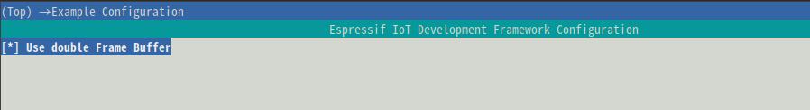
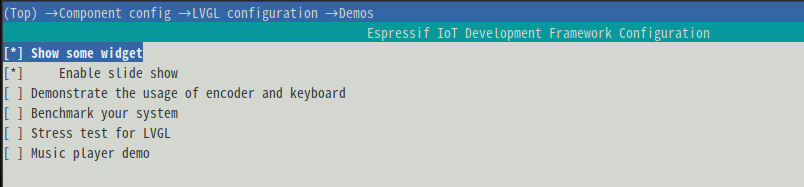

# This example is used to demonstrate the running example in the esp-idf V5.0 environment.
The build steps are as follows:

```
cd T-RGB
get_idf # Get the current idf environment
idf.py set-target esp32s3 
idf.py build flash monitor #Basic display logo image

```

This routine integrates some demos of lvgl. The following commands can be used for selection.
```
idf.py menuconfig 
```

## step 1

## step 2

## step 3 
Choose any example (if you choose music, you need to open 12 and 16 fonts to compile normally)


```
idf.py build flash monitor 
```